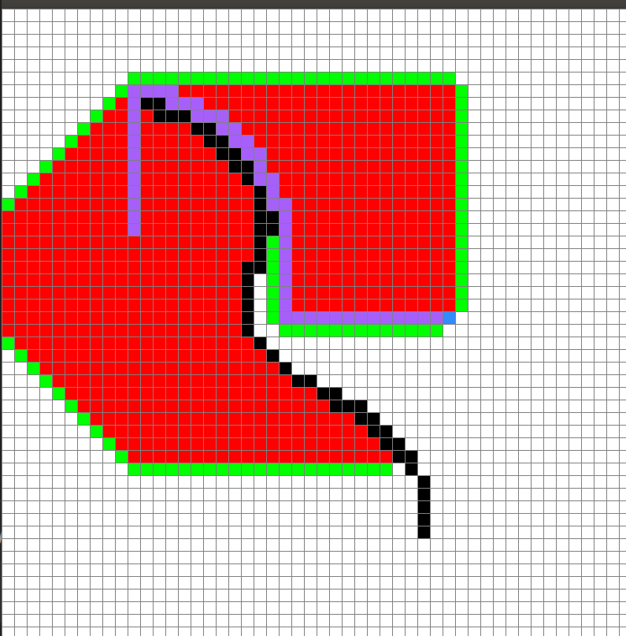

# A* Pathfinding Algorithm with Visualization
[A*](https://en.wikipedia.org/wiki/A*_search_algorithm) is a graph traversal and path search algorithm, 
which is often used in many fields of computer science due to its completeness, 
optimality, and optimal efficiency. 

A* is a **best-first search**, 
meaning that it is formulated in terms of weighted graphs: 
starting from a specific starting node of a graph, 
it aims to find a path to the given goal node having the smallest cost 
(least distance travelled, etc.). 

A* select the shortest path that minimizes the function:

<a href="https://www.codecogs.com/eqnedit.php?latex=f(n)&space;=&space;g(n)&space;&plus;&space;h(n)" target="_blank"></a>

where `n` is the current node in the graph, `g(n)` is the cost of the path from the start node to `n`, 
`h(n)` is a heuristic function that estimate the minimum cost from the current node to the goal. 
If you want to know more, please check [here](https://en.wikipedia.org/wiki/A*_search_algorithm). 

# Want to Play with the Program?
To see how the algorithm works, execute the `main.py` program:

```
  python3 main.py
```
Note that you to have `pygame` installed. 

**Don't want to download the program? Try it in Gitpod!** 

[](https://github.com/ShiqiHe000/A_start_pathfinding_algorithm/main.py)

## How to Play?
Use you mouse to choose the **start point** (first clik, orange node) and **end point** (second clik, blue node). 
Then press the left key and feel free to draw the **barriers** (black nodes) bewtween the start node and end node. 

When you finished, press space key to see the algorithm processes and find the shortest path between two targeted node.
In the end, the shortest path will be colored in purple. To restart the program, press `c`. 

<p align="center">
  
</p>
